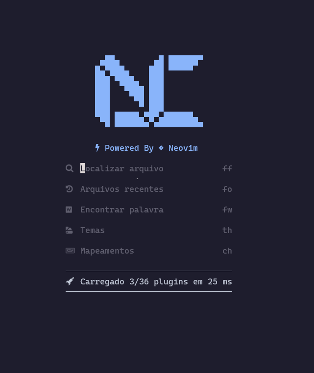

<h1 align="center">
    NEOVIM MARTINS
</h1>

# Credito

<h5 align="center">
    https://nvchad.com/
</h5>

# Imagem do Projeto



## Estrutura do Projeto 📝

```plaintext
├── .vscode
├── lua
│   ├── config                  # Pasta de configuração
│   │   ├── lazy.lua            # Arquivo config
│   ├── plugins                 # Pasta de plugins
│   │   ├── _lsp.lua            # plugin _lsp
│   │   ├── cmp.lua             # plugin cmp
│   │   ├── cmpcmdline.lua      # plugin cmpcmdline
│   │   ├── conform.lua         # plugin conform
│   │   ├── lualine.lua         # plugin lualine
│   │   ├── toggleterm.lua      # plugin toggleterm
│   ├── snippets                # Pasta de html
│   │   ├── html                # Pasta css/html
│   │   ├── ├── snippets.json   # Arquivo snippets
│   │   ├── package.json        # Arquivo depedencias
├── .editorconfig               # Arquivo config padrões
├── .gitignore                  # Arquivo ignora a subida para github
├── .stylua.toml                # Arquivo config padrões do lua
├── img.png                     # Imagem abertura da IDE
├── init.lua                    # Arquivo inicializa a projeto
├── lazy-lock.json              # Arquivo quarta informações de dependência do projeto
├── LICENSE                     # Arquivo de licença de usabilidade
├── README.md                   # Documentação do projeto
```

## Licença 📝

Este projeto é licenciado sob [CC0 1.0 Universal]. Consulte o arquivo [LICENSE](https://github.com/SilvaneiMartins/neovim-martins/blob/master/LICENSE) para obter detalhes.

## Doações 💰

Se você achar este projeto útil e quiser apoiar seu desenvolvimento contínuo, você pode fazer uma doação via `PIX` para e-mail `silvaneimartins@hotmail.com`.

Muito ❤️ pelo apoio!

## Contato 📩

<a href="https://github.com/SilvaneiMartins">
    
    <br />
    <sub>
        <b>Silvanei de Almeida Martins</b>
    </sub>
</a>
     <a href="https://github.com/SilvaneiMartins" title="Silvanei martins" >
 </a>
<br />
🚀 Feito com ❤️ por Silvanei Martins
